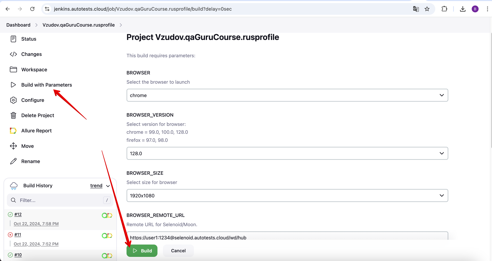
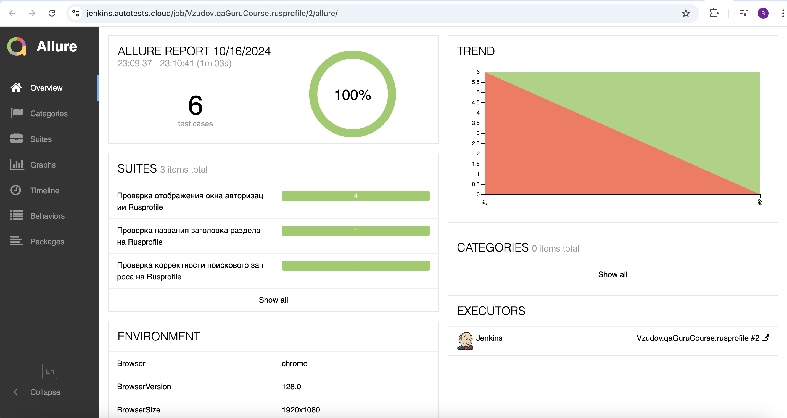
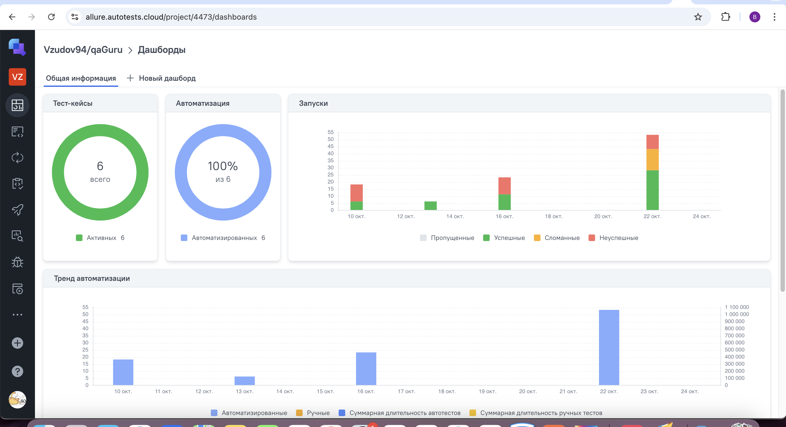
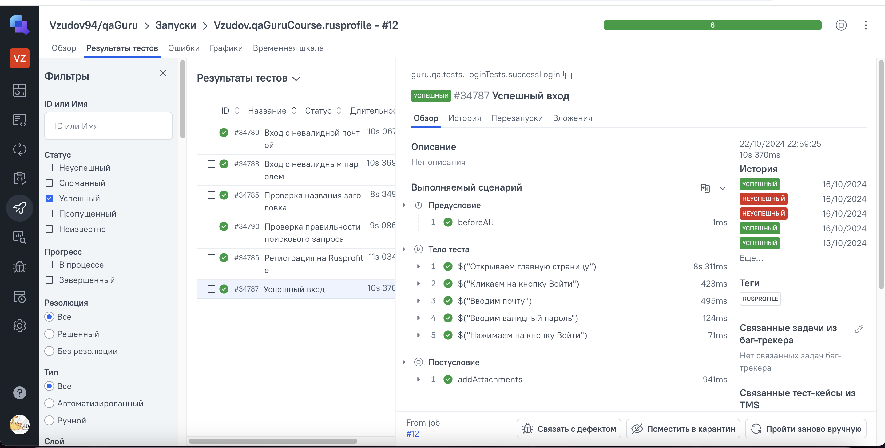
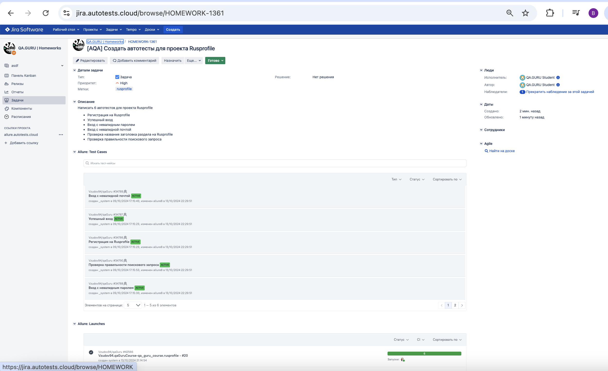
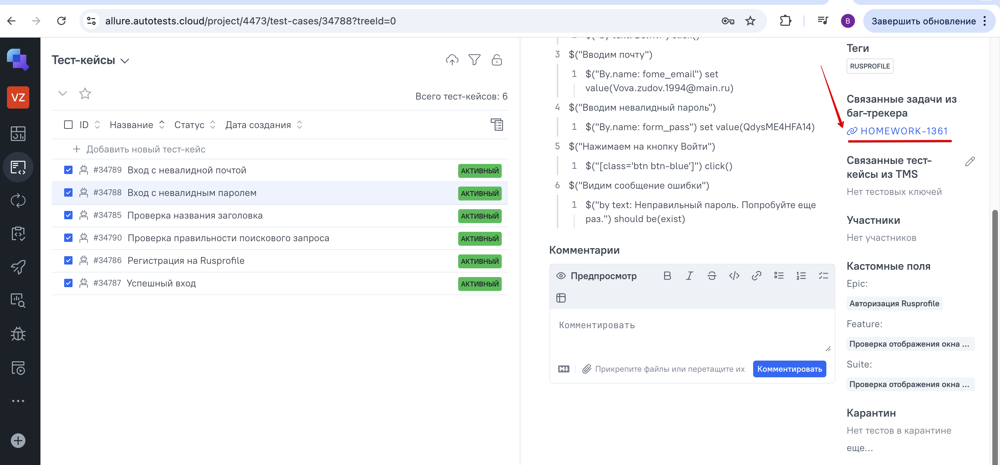
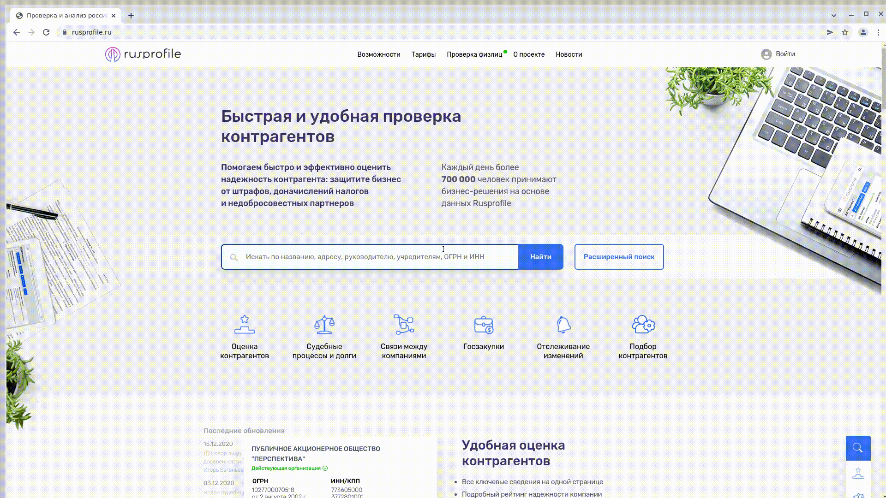

# Проект-презентация по автоматизации для сайта "Rusprofile"


## :pushpin: Содержание:

- <a href="#tools"> Стек используемых технологий</a>
- <a href="#cases"> Реализованные проверки
- <a href="#console"> Запуск автотестов</a>
- <a href="#jenkins"> Параметры сборки в Jenkins</a>
- <a href="#assemblyJenkins"> Сборка в Jenkins</a> 
- <a href="#allureReport"> Пример Allure-отчета</a>
- <a href="#allureTestOps"> Интеграция с Allure TestOps</a>
- <a href="#jira"> Интеграция с Jira</a>
- <a href="#video"> Видео примера запуска тестов в Selenoid</a>

<a id="tools"></a>
## Стек используемых технологий

<p align="center">
<a href="https://www.w3schools.com/java/">  </a>
<a href="https://selenide.org/">  </a>
<a href="https://junit.org/junit5/">  </a>
<a href="https://gradle.org/">  </a>
<a href="https://aerokube.com/selenoid-ui/latest/">  </a>
<a href="https://docs.qameta.io/allure-testops/">  </a>
<a href="https://allurereport.org/">  </a>
<a href="https://www.atlassian.com/software/jira">  </a>
<a href="https://www.jenkins.io/">  </a>
</p>

- В данном проекте автотесты написаны на языке <code>Java</code> с использованием фреймворка для тестирования Selenide.
- В качестве сборщика был использован - <code>Gradle</code>.
- Использованы фреймворки <code>JUnit 5</code> и <code>Selenide</code>
- При прогоне тестов браузер запускается в <code>Selenoid</code>
- Для удаленного запуска реализована джоба в <code>Jenkins</code> с формированием Allure-отчета и отправкой результатов в <code>Telegram</code> при помощи бота.
- Осуществлена интеграция с <code>Allure TestOps</code> и <code>Jira</code>

Содержание Allure-отчета:
* Шаги теста;
* Скриншот страницы на последнем шаге;
* Page Source;
* Логи браузерной консоли;
* Видео выполнения автотеста.

<a id="cases"></a>
## :ballot_box_with_check: Реализованные проверки

Автоматизированные тесты

- Регистрация на Rusprofile
- Успешный вход
- Вход с невалидным паролем
- Вход с невалидной почтой
- Проверка названия заголовка раздела на Rusprofile
- Проверка правильности поискового запроса

<a id="console"></a>
## :arrow_forward: Запуск автотестов

### Запуск тестов из терминала

Локальный запуск:
```
gradle clean rusprofile 
```
Удаленный запуск:
```
clean rusprofile -Dbrowser=${BROWSER} -DbrowserVersion=${BROWSER_VERSION} -DbrowserSize=${BROWSER_SIZE}  -DbrowserRemoteUrl=${BROWSER_REMOTE_URL}
```

Для запуска сборки необходимо перейти в раздел ```Build with Parameters```, выбрать необходимые параметры и нажать кнопку ```Build```.

<a id="jenkins"></a>
## :hammer_and_wrench:: Параметры сборки в Jenkins:
- BROWSER (браузер: chrome/firefox, по умолчанию chrome)
- BROWSER_VERSION (версия браузера, по умолчанию 100.0)
- BROWSER_SIZE (размер окна браузера, по умолчанию 1920x1080)
- REMOTE_URL (адрес удаленного сервера для запуска)

<a id="assemblyJenkins"></a>
## <a href="https://www.jenkins.io/">  </a> Сборка в Jenkins
<p align="center">

</p>

После выполнения сборки, в блоке Build History напротив номера сборки появятся значки Allure Report и Allure TestOps, при клике на которые откроется страница с сформированным html-отчетом и тестовой документацией соответственно.

<a id="allureReport"></a>
## <a href="https://allurereport.org/">  </a> Пример Allure-отчета
### Overview

<p align="center">

</p>

<a id="allureTestOps"></a>
## <a href="https://docs.qameta.io/allure-testops/">  </a> Интеграция с Allure TestOps

Выполнена интеграция сборки <code>Jenkins</code> с <code>Allure TestOps</code>.
Результат выполнения автотестов отображается в <code>Allure TestOps</code>
На Dashboard в <code>Allure TestOps</code> отображена статистика пройденных тестов.

<p align="center">

</p>

### Результат выполнения автотеста в прогоне

<p align="center">

</p>

<a id="jira"></a>
##  </a> Интеграция с <a target="_blank" href="https://jira.autotests.cloud/browse/HOMEWORK-1131"> Jira </a>

Реализована интеграция ```Allure TestOps``` с ```Jira```, в тикете отображается, какие тест-кейсы были написаны в рамках задачи и результат их прогона.

<p align="center">

</p>

И наоборот, у тест кейсов отображается ссылка на тикет в Jira, во вкладке ```Test cases```.

<p align="center">

</p>

<a id="video"></a>
## Видео примера запуска тестов в Selenoid

К каждому тесту в отчете прилагается видео прогона.
<p align="center">
  
</p>